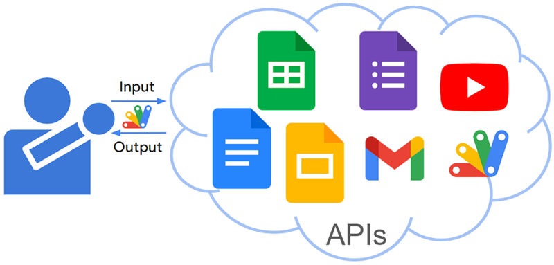
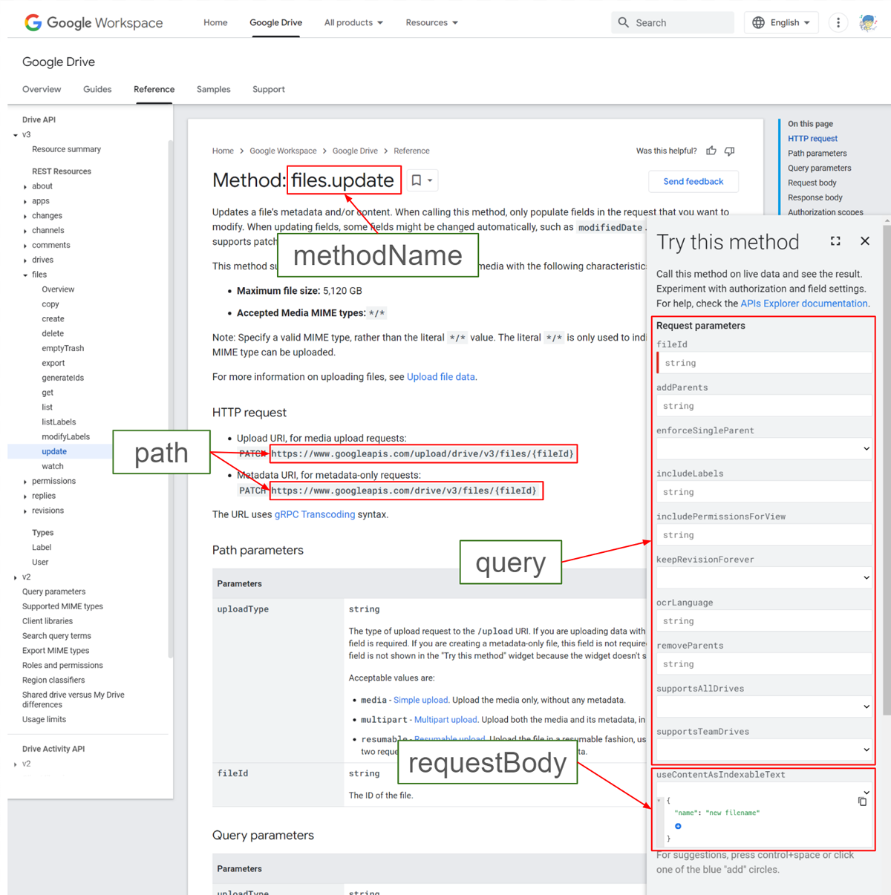

# GoogleApiApp

<a name="top"></a>

[MIT License](LICENCE)

<a name="overview"></a>

# Overview

This is a Google Apps Script library for supporting to use Google APIs with Google Apps Script.



<a name="description"></a>

# Description

There are numerous powerful Google APIs available today. Google Apps Script streamlines interacting with these APIs through a simplified authorization process. Additionally, advanced Google services integrate seamlessly with Apps Script, making Google APIs highly advantageous for users.

However, utilizing APIs beyond advanced Google services can be challenging for some users. Developing a simpler method for using various Google APIs would significantly increase their accessibility and empower a broader range of users to create diverse applications.

To address this challenge, I recently created a Google Apps Script library called GoogleApiApp that simplifies the process of using various Google APIs.

This library offers the following functionalities:

- Simplified API Calls: When a valid access token is present, users can directly interact with various Google APIs through Apps Script. This requires providing the API name, the desired method, and the necessary values.
- Automatic Pagination: For APIs that utilize pagination through a pageToken, this library automatically retrieves all available items by handling the pageToken internally.

# Library's project key

```
1YVWd5qzz0quKljrJkliE143UwwJq1BopoZQSwNEqwNgHOPQ9VeaQeNS7
```

<a name="usage"></a>

# Usage

## 1. Install library

In order to use this library, please install the library as follows.

1. Create a GAS project.

   - You can use this library for the GAS project of both the standalone and container-bound script types.

2. [Install this library](https://developers.google.com/apps-script/guides/libraries).

   - Library's project key is **`1YVWd5qzz0quKljrJkliE143UwwJq1BopoZQSwNEqwNgHOPQ9VeaQeNS7`**.

## 2. Linking Google Cloud Platform Project to Google Apps Script Project

When the script editor of Google Apps Script, several Google APIs can be used with Advanced Google services. But, when the Google APIs you want to use cannot be used with Advanced Google services, it might be required to link the Google Cloud Platform Project to the Google Apps Script Project.

If you want to link the Google Cloud Platform Project to the Google Apps Script Project for New IDE, you can see how to do this at [my repository](https://github.com/tanaikech/Linking-Google-Cloud-Platform-Project-to-Google-Apps-Script-Project-for-New-IDE).

At that time, please enable the API at the API console.

# Scopes

This library uses the following scope.

- `https://www.googleapis.com/auth/script.external_request`

# IMPORTANT

When you use Google APIs using this library, please enable the APIs you want to use at Advanced Google services or the API console. Also, please check the scopes for using the APIs you want to use. When you run the script without setting them, an error occurs. Please be careful about this.

When an error like `Request had insufficient authentication scopes.` occurs, please include the required scopes and test it again.

# Flow of this library

## Flow of the Library:

1. Discovery URL Retrieval: Obtain the discovery document URL by searching Google APIs using the Google API Discovery Service: https://developers.google.com/discovery.
2. Method Information Retrieval: Extract information about the desired API method from the retrieved discovery document URL.
3. API Request: Make the API request using the retrieved information.

## Functionality:

This library allows users to interact with Google APIs by simply providing the API name, method name, and necessary parameters. The library automatically constructs the endpoint URL and request method based on the retrieved API information.

## Limitations:

Currently, the library is limited to Google APIs discoverable through the Google API Discovery Service: https://developers.google.com/discovery. This means APIs not registered with this service, like the current version of Gemini API, are not yet supported. However, future updates are expected to expand compatibility.

# Methods

| Methods                           | Description                                              |
| :-------------------------------- | :------------------------------------------------------- |
| [setAPIInf](#setapiinf)           | Set information of Google API you want to use.           |
| [setAPIParams](#setapiparams)     | Set parameters for using the Google API you want to use. |
| [setAccessToken](#setaccesstoken) | Set access token.                                        |
|                                   |                                                          |
| [getAPI](#getapi)                 | Get information of Google API.                           |
| [request](#request)               | Request Google API.                                      |

<a name="setapiinf"></a>

## setAPIInf

Set information of the Google API you want to use.

For example, when you want to get ["Method: files.get" of Drive API v3](https://developers.google.com/drive/api/reference/rest/v3/files/get), you can use the following script.

```javascript
const apiInf = {
  api: "drive",
  version: "v3",
  methodName: "files.get",
};
const res = GoogleApiApp.setAPIInf(apiInf).getAPI();
console.log(res);
```

For example, when you want to get ["Method: users.settings.sendAs.smimeInfo.get" of Gmail API v1](https://developers.google.com/gmail/api/reference/rest/v1/users.settings.sendAs.smimeInfo/get), you can use the following script.

```javascript
const apiInf = {
  api: "gmail",
  version: "v1",
  methodName: "users.settings.sendAs.list",
};
const res = GoogleApiApp.setAPIInf(apiInf).getAPI();
console.log(res);
```

For example, when you want to get ["Method: spreadsheets.values.get" of Sheets API v4](https://developers.google.com/sheets/api/reference/rest/v4/spreadsheets.values/get), you can use the following script.

```javascript
const apiInf = {
  api: "sheets",
  version: "v4",
  methodName: "spreadsheets.values.get",
};
const res = GoogleApiApp.setAPIInf(apiInf).getAPI();
console.log(res);
```

- `api`: Name of Google API.
- `version`: Version of Google API.
- `methodName`: Method name of Google API.

When the valid response is returned with your value of `apiInf`, this can be also used with the method of `request`.

<a name="setapiparams"></a>

## setAPIParams

Set parameters for using the Google API you want to use. This object includes as follows.

`path`: Object Ex. fileId. This value is used in the endpoint.
`query`: Object Ex. fields. This value is used in the query parameter of the endpoint.
`requestBody`: Object Ex. {name: "sample title"}. This value is used as the request body of the API.
`usePageToken`: Boolean When this is true, the response value is retrieved with pageToken. The default value is false.

For example, when you want to update the filename of a file on Google Drive, the sample script is as follows.

```javascript
const apiInf = {
  api: "drive",
  version: "v3",
  methodName: "files.update",
};
const apiParams = {
  path: { fileId: "###" }, // Please set your file ID.
  query: { fields: "id,name" },
  requestBody: { name: "new filename" },
};
const res = GoogleApiApp.setAPIInf(apiInf).setAPIParams(apiParams).request();
console.log(res);
```

<a name="setaccesstoken"></a>

## setAccessToken

Set access token. When you are required to use the specific access token, please use this method. When the API key is not used, this access token is used. If the API key is not used and this method is not used, the access token retrieved by `ScriptApp.getOAuthToken()` is used. For example, if you want to use the access token retrieved from the service account. Please set the access token using this method.

When the above script is used, the sample script is as follows.

```javascript
const apiInf = {
  api: "drive",
  version: "v3",
  methodName: "files.update",
};
const apiParams = {
  path: { fileId: "###" }, // Please set your file ID.
  query: { fields: "id,name" },
  requestBody: { name: "new filename" },
};
const res = GoogleApiApp.setAPIInf(apiInf)
  .setAPIParams(apiParams)
  .setAccessToken("###your access token###")
  .request();
console.log(res.getContentText());
```

<a name="getapi"></a>

## getAPI

Get information of Google API.

You can see the sample scripts in the section "[setAPIInf](#setapiinf)".

<a name="request"></a>

## request

Request Google API.

About the value of `apiInf` and `apiParams` in the following sample scripts, for example, when ["Method: files.update"](https://developers.google.com/drive/api/reference/rest/v3/files/update) is used as a sample, each value is as follows. Also, you can see them in the following image.



`path`: The variables in the endpoint. It's `fileId` of `https://www.googleapis.com/upload/drive/v3/files/{fileId}`. You can see this at [HTTP request](https://developers.google.com/drive/api/reference/rest/v3/files/update#http-request) at the official document.
` query`: You can see them at [Query parameters](https://developers.google.com/drive/api/reference/rest/v3/files/update#query-parameters). The API key is included in this. You can see this at [Try this method](https://developers.google.com/drive/api/reference/rest/v3/files/update?apix=true) at the official document.
`requestBody`: You can see them at [Request body](https://developers.google.com/drive/api/reference/rest/v3/files/update#request-body). You can create the request body at [Try this method](https://developers.google.com/drive/api/reference/rest/v3/files/update?apix=true) at the official document.

### Sample 1

In this sample, "[Method: files.update](https://developers.google.com/drive/api/reference/rest/v3/files/update)" is tested.

In this case, please enable Drive API at Advanced Google services. And, please add a scope of `https://www.googleapis.com/auth/drive`.

When you want to update the filename of a file on Google Drive, the sample script is as follows.

```javascript
const apiInf = {
  api: "drive",
  version: "v3",
  methodName: "files.update",
};
const apiParams = {
  path: { fileId: "###" }, // Please set your file ID.
  query: { fields: "id,name" },
  requestBody: { name: "new filename" },
};
const res = GoogleApiApp.setAPIInf(apiInf).setAPIParams(apiParams).request();
console.log(res.getContentText());
```

### Sample 2

In this sample, "[Method: files.get](https://developers.google.com/drive/api/reference/rest/v3/files/get)" is tested.

In this case, please enable Drive API at Advanced Google services. And, please add one of the scopes of `https://www.googleapis.com/auth/drive`, `https://www.googleapis.com/auth/drive.readonly`.

When you want to download a file, the sample script is as follows.

```javascript
const apiInf = {
  api: "drive",
  version: "v3",
  methodName: "files.get",
};
const apiParams = {
  path: { fileId: "###" }, // Please set your file ID. In this case, please set the file ID of the files except for Google Docs files.
  query: { alt: "media" },
};
const res = GoogleApiApp.setAPIInf(apiInf).setAPIParams(apiParams).request();
const blob = res.getBlob(); // This is a blob of the downloaded file.
```

- `request` method returns 2 pattern objects like `UrlFetchApp.HTTPResponse` or `String[]`. When `usePageToken: true` is NOT used, `UrlFetchApp.HTTPResponse` is returned. When `usePageToken: true` is used, `String[]` is returned. So, the following script can be used for both patterns.

  ```javascript
  const res = GoogleApiApp.setAPIInf(apiInf).setAPIParams(apiParams).request();
  if (Array.isArray(res)) {
    console.log(res);
  } else {
    console.log(res.getContentText()); // and/or const blob = res.getBlob();
  }
  ```

### Sample 3

In this sample, "[Method: projects.getContent](https://developers.google.com/apps-script/api/reference/rest/v1/projects/getContent)" is tested.

In this case, please link the Google Cloud Platform Project to the Google Apps Script Project. And enable Apps Script API at the API console. And, please add one of the scopes of `https://www.googleapis.com/auth/script.projects` and `https://www.googleapis.com/auth/script.projects.readonly`.

When you want to retrieve the scripts from the Google Apps Script project, the sample script is as follows. In this case, [Method: projects.getContent](https://developers.google.com/apps-script/api/reference/rest/v1/projects/getContent) of Apps Script API v1 is used.

```javascript
const apiInf = {
  api: "script",
  version: "v1",
  methodName: "projects.getContent",
};
const apiParams = {
  path: { scriptId: "###" }, // Please set your script ID.
};
const res = GoogleApiApp.setAPIInf(apiInf).setAPIParams(apiParams).request();
console.log(res.getContentText());
```

### Sample 4

In this sample, "[Method: forms.get](https://developers.google.com/forms/api/reference/rest/v1/forms/get)" is tested.

In this case, please link the Google Cloud Platform Project to the Google Apps Script Project. And, enables Forms API at the API console. And, please add one of the scopes of `https://www.googleapis.com/auth/script.projects` and `https://www.googleapis.com/auth/script.projects.readonly`.

When you want to retrieve a Google Form with Google Forms API v1, the sample script is as follows. In this case, [Method: forms.get](https://developers.google.com/forms/api/reference/rest/v1/forms/get) of Forms API v1 is used.

```javascript
const apiInf = {
  api: "forms",
  version: "v1",
  methodName: "forms.get",
};
const apiParams = {
  path: { formId: "###" }, //  Please set your Google Form ID.
};
const res = GoogleApiApp.setAPIInf(apiInf).setAPIParams(apiParams).request();
console.log(res.getContentText());
```

### Sample 5: Automatic Pagination

In this sample, "[Method: files.list](https://developers.google.com/drive/api/reference/rest/v3/files/list)" is tested.

In this case, please enable Drive API at Advanced Google services. And, please add one of the scopes of `https://www.googleapis.com/auth/drive`, `https://www.googleapis.com/auth/drive.readonly`, `https://www.googleapis.com/auth/drive.metadata.readonly`.

When you want to retrieve the file and folder list in your Google Drive, the sample script is as follows.

```javascript
const apiInf = {
  api: "drive",
  version: "v3",
  methodName: "files.list",
};
const apiParams = {
  query: { orderBy: "name", fields: "files(id,name)" },
  usePageToken: true,
};
const res = GoogleApiApp.setAPIInf(apiInf).setAPIParams(apiParams).request();
console.log(res);
```

- In this case, when `usePageToken: true` is used, all files and folders are retrieved using `pageToken`. In this case, all methods of the Google APIs using `pageToken` can be used. When `usePageToken: true` is not used, only one page is retrieved. I believe that this will be an important point of this library.

As another sample, "[Method: comments.list](https://developers.google.com/drive/api/reference/rest/v3/comments/list)" is tested. When you want to retrieve all comments from a file, you can use the following sample script.

```javascript
const apiInf = {
  api: "drive",
  version: "v3",
  methodName: "comments.list",
};
const apiParams = {
  path: { fileId: "###", // Please set your file ID.
  usePageToken: true,
};
const res = GoogleApiApp.setAPIInf(apiInf).setAPIParams(apiParams).request();
console.log(res);
```

### Sample 6: Automatic Pagination

In this sample, "[Method: people.connections.list](https://developers.google.com/people/api/rest/v1/people.connections/list)" is tested.

In this case, please enable People API at Advanced Google services. And, please add one of the scopes of `https://www.googleapis.com/auth/contacts`, `https://www.googleapis.com/auth/contacts.readonly`.

The sample script is as follows.

```javascript
const apiInf = {
  api: "people",
  version: "v1",
  methodName: "people.connections.list",
};
const apiParams = {
  path: { resourceName: "people/me" },
  query: { personFields: "emailAddresses" },
  usePageToken: true,
};
const res = GoogleApiApp.setAPIInf(apiInf).setAPIParams(apiParams).request();
console.log(res);
```

### Sample 7: Automatic Pagination

In this sample, "[Method: courses.list](https://developers.google.com/classroom/reference/rest/v1/courses/list)" is tested.

In this case, please enable Classroom API at Advanced Google services. And, please add one of the scopes of `https://www.googleapis.com/auth/classroom.courses`, `https://www.googleapis.com/auth/classroom.courses.readonly`.

The sample script is as follows.

```javascript
const apiInf = {
  api: "classroom",
  version: "v1",
  methodName: "courses.list",
};
const apiParams = {
  usePageToken: true,
};
const res = GoogleApiApp.setAPIInf(apiInf).setAPIParams(apiParams).request();
console.log(res);
```

### Sample 8: Automatic Pagination

In this sample, "[Videos: list](https://developers.google.com/youtube/v3/docs/videos/list)" is tested.

In this case, please enable YouTube API at Advanced Google services. And, please add one of the scope of `https://www.googleapis.com/auth/youtube`.

**By the way, in this API, it seems that `methodName` is `videos.list`.**

The sample script is as follows.

```javascript
const apiInf = {
  api: "youtube",
  version: "v3",
  methodName: "videos.list",
};
const apiParams = {
  query: { part: "id", chart: "mostPopular" },
  usePageToken: true,
};
const res = GoogleApiApp.setAPIInf(apiInf).setAPIParams(apiParams).request();
console.log(res);
```

# Note

- I tested this library with Google APIs I often use. But, I cannot test all Google APIs. When I found the APIs that cannot be used with this library, I would like to add them.

- When the API is not included in [Google API Discovery Service](https://developers.google.com/discovery), this library cannot use it. For example, in the current stage, it seems that Gemini API is not still included in Google API Discovery Service. So, it cannot be used.

---

<a name="licence"></a>

# Licence

[MIT](LICENCE)

<a name="author"></a>

# Author

[Tanaike](https://tanaikech.github.io/about/)

[Donate](https://tanaikech.github.io/donate/)

<a name="updatehistory"></a>

# Update History

- v1.0.0 (March 14, 2024)

  1. Initial release.

[TOP](#top)
