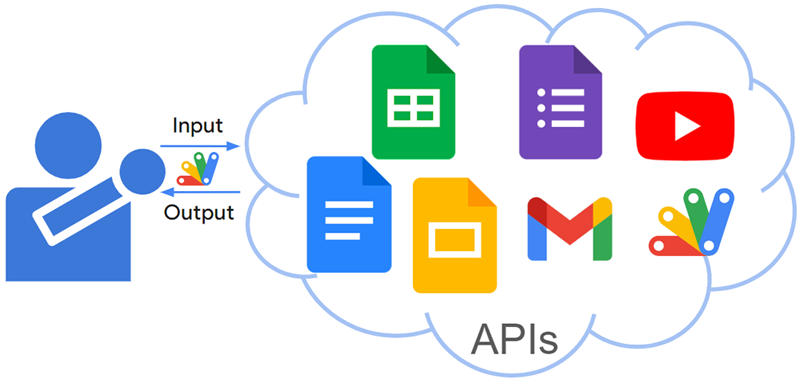

# GoogleApiApp

<a name="top"></a>

[MIT License](LICENCE)

<a name="overview"></a>

# Overview

This is a Google Apps Script library for supporting the use of Google APIs with Google Apps Script. It features automatic discovery URL handling, pagination, built-in V8-compatible caching, and comprehensive logging.



<a name="description"></a>

# Description

There are numerous powerful Google APIs available today. Google Apps Script streamlines interacting with these APIs through a simplified authorization process. Additionally, advanced Google services integrate seamlessly with Apps Script, making Google APIs highly advantageous for users.

However, utilizing APIs beyond advanced Google services can be challenging for some users. Developing a simpler method for using various Google APIs would significantly increase their accessibility and empower a broader range of users to create diverse applications.

To address this challenge, I created a Google Apps Script library called GoogleApiApp that simplifies the process of using various Google APIs. **Version 2.1.1** introduces a robust ES6 Class architecture with intelligent parameter parsing and static caching, allowing you to use this either as a Library or by directly copying the source code into your project. It offers vast improvements in execution speed and superior error tracing.

This library offers the following functionalities:

- **Simplified API Calls:** Interact with various Google APIs directly through Apps Script with an API name, method, and parameters.
- **Smart Parameter Injection:** Distinct handling of endpoint paths and query strings. Path parameters support composite resource names (e.g., `properties/12345`) without aggressive URL encoding, while query parameters are strictly URL-encoded.
- **Automatic Pagination:** For APIs that utilize pagination through a pageToken, this library automatically retrieves all available items.
- **Real-Time Logging & Debugging:** Pass a callback to trace executions, endpoints, payload injections, and detailed errors.
- **Backward Compatibility:** Legacy users don't need to change a single line of code after updating to the latest version.

# Library's project key

```text
1YVWd5qzz0quKljrJkliE143UwwJq1BopoZQSwNEqwNgHOPQ9VeaQeNS7
```

<a name="usage"></a>

# Usage

## 1. Install Library OR Direct Copy-Paste

**Option A (As a GAS Library):**
Install the library via project key: `1YVWd5qzz0quKljrJkliE143UwwJq1BopoZQSwNEqwNgHOPQ9VeaQeNS7`. Legacy users using `GoogleApiApp.setAPIInf(...)` will retain full functionality.

**Option B (Direct Copy-Paste):**
You can directly copy the source code of `GAApp` class into your own GAS script to run locally without library dependencies. You instantiate it via:

```javascript
const app = new GAApp();
```

## 2. Linking Google Cloud Platform Project to Google Apps Script Project

When the Google APIs you want to use cannot be used with Advanced Google services, it might be required to link the Google Cloud Platform Project to the Google Apps Script Project. Please enable the API at the API console.

# Scopes

This library uses the following scope:

- `https://www.googleapis.com/auth/script.external_request`

# IMPORTANT

When you use Google APIs using this library, please enable the APIs you want to use at **Advanced Google services** (the "+" button next to Services) or the API console. Also, please check the scopes for using the APIs you want to use.

When an error like `Request had insufficient authentication scopes` occurs, the library will now provide a clear, user-friendly exception telling you exactly which scopes to add to your `appsscript.json`.

# Methods

| Methods                           | Description                                              |
| :-------------------------------- | :------------------------------------------------------- |
| [setAPIInf](#setapiinf)           | Set information of Google API you want to use.           |
| [setAPIParams](#setapiparams)     | Set parameters for using the Google API you want to use. |
| [setAccessToken](#setaccesstoken) | Set access token.                                        |
| [getAPI](#getapi)                 | Get information of Google API.                           |
| [request](#request)               | Request Google API (accepts optional logger callback).   |
| [getLogs](#getlogs)               | Retrieve historical logs generated by API requests.      |

---

<a name="setapiinf"></a>

## setAPIInf

Set information of the Google API you want to use.

_If using the global library method:_

```javascript
const res = GoogleApiApp.setAPIInf({
  api: "drive",
  version: "v3",
  methodName: "files.get",
}).getAPI();
```

_If using directly via class (Copy-Paste):_

```javascript
const app = new GAApp();
const res = app
  .setAPIInf({ api: "drive", version: "v3", methodName: "files.get" })
  .getAPI();
```

<a name="setapiparams"></a>

## setAPIParams

Set parameters for using the Google API you want to use.

- `path`: Used in the endpoint (e.g., `{ fileId: "###" }` or `{+name}`). **These values are NOT URL-encoded**, allowing you to seamlessly pass composite Google Cloud resource names containing slashes (e.g., `properties/12345`).
- `query`: Query string parameters appended to the URL (e.g., `{ fields: "id,name" }`). **These values are strictly URL-encoded.**
- `requestBody`: JSON body payloads.
- `usePageToken`: `true` automatically retrieves all paginated items across multiple requests.

<a name="request"></a>

## request (with optional logging)

Request Google API. You can pass a callback function to retrieve real-time traces.

### Sample 1: Standard Execution with Logs

```javascript
const apiInf = { api: "drive", version: "v3", methodName: "files.update" };
const apiParams = {
  path: { fileId: "YOUR_FILE_ID" },
  requestBody: { name: "new filename" },
};

// With Library Wrapper:
const res = GoogleApiApp.setAPIInf(apiInf)
  .setAPIParams(apiParams)
  .request((log) => console.log(log));
console.log(res.getContentText());
```

### Sample 2: Automatic Pagination

When you set `usePageToken: true`, all paginated items across multiple API calls are recursively aggregated for you.

```javascript
const app = new GAApp(); // Using Direct Class approach
const apiInf = { api: "drive", version: "v3", methodName: "files.list" };
const apiParams = {
  query: { orderBy: "name", fields: "files(id,name)" },
  usePageToken: true, // Magically fetches all records!
};

const res = app.setAPIInf(apiInf).setAPIParams(apiParams).request();
console.log(`Total retrieved items: ${res.length}`);
```

### Sample 3: Combined Path and Query Parameters

Demonstrates the independent handling of unencoded path parameters and strictly encoded query parameters.

```javascript
const app = new GAApp();
const apiInf = { api: "drive", version: "v3", methodName: "files.get" };

// 'fileId' replaces `{fileId}` in the path WITHOUT encoding.
// 'fields' is strictly URL-encoded as a query parameter (e.g., ?fields=id%2Cname).
const apiParams = {
  path: { fileId: "YOUR_FILE_ID" },
  query: { fields: "id,name,mimeType" },
};

const res = app
  .setAPIInf(apiInf)
  .setAPIParams(apiParams)
  .request((log) => console.log(log));
console.log(JSON.parse(res.getContentText()));
```

# Note

- For unsupported Google APIs (ones not discoverable via Google API Discovery Service like early-stage Gemini APIs), they cannot be used yet.

---

<a name="licence"></a>

# Licence

[MIT](LICENCE)

<a name="author"></a>

# Author

[Tanaike](https://tanaikech.github.io/about/)

<a name="updatehistory"></a>

# Update History

- v2.1.1 (May 24, 2026)
  1. Restructured caching implementation to use prototype-attached static properties, resolving syntax parsing errors in the GAS V8 engine while retaining cross-instance performance benefits.
  2. Implemented strict separation of URL encoding logic: Path parameters mapping to `{resource}` or `{+resource}` are no longer URL-encoded to support Google APIs composite names (e.g., `properties/123`), while Query parameters continue to be safely URL-encoded.
  3. Fortified RegExp replacement logic to eliminate substring collision risks during endpoint construction.
- v2.0.0 (May 19, 2026)
  1. Complete refactor adopting an ES6 Class structure (`GAApp`).
  2. Implemented Discovery Document caching mechanisms reducing sequential execution times.
  3. Added real-time callback logging and user-friendly error interpretations for 401/403 errors.
  4. Script can now be copied entirely standalone into a user's script, while simultaneously maintaining 100% backward compatibility for existing global library users.
- v1.0.0 (March 14, 2024)
  1. Initial release.

[TOP](#top)
